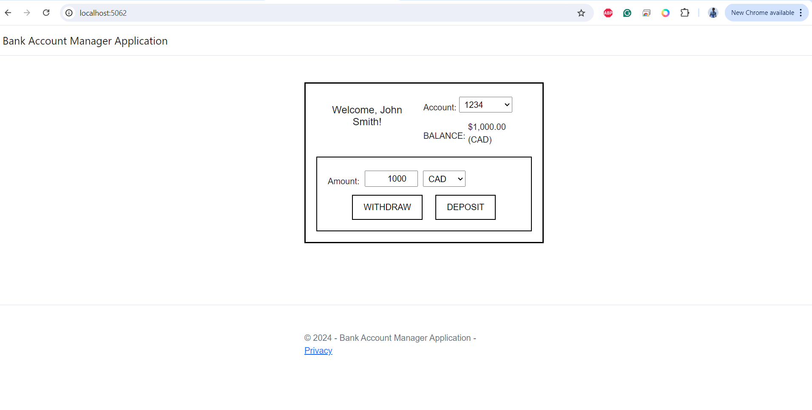
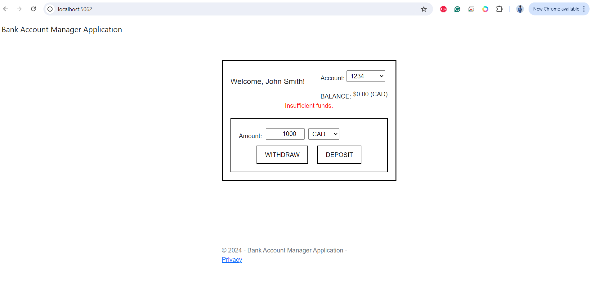

# Bank Account Manager Application

This project is a simple bank account manager application developed as part of the DataCan Software Developer hiring process. The application allows users to create checking accounts, display the current balance, and perform deposits and withdrawals in different currencies. The balance is always tracked in Canadian dollars (CAD), and currency conversions are handled according to predefined exchange rates.

## Technologies Used

- **.NET 8 (SDK 8.0.401)**: The project is built using .NET 8 and ASP.NET Core MVC.
- **C#**: The backend logic and currency conversion are implemented in C#.
- **HTML/CSS/JavaScript**: The frontend is created using standard web technologies.
- **jQuery**: Used for making AJAX calls to perform deposits and withdrawals without reloading the page.

## Features

- **Account Management**: Display the current balance of the account.
- **Deposit & Withdraw**: Allows users to deposit or withdraw amounts in different currencies (CAD, USD, MXN, EURO).
- **Currency Conversion**: Automatic conversion of foreign currencies to CAD using predefined exchange rates.
- **Error Handling**: Displays user-friendly error messages when there are insufficient funds during withdrawal.

## Exchange Rates

- 1.00 CAD = 0.50 USD
- 1.00 CAD = 10.00 MXN
- 1.00 CAD = 0.25 EURO

## Installation & Setup

### Prerequisites

- [.NET SDK 8.0.401](https://dotnet.microsoft.com/download/dotnet/8.0) installed on your machine.
- Any code editor (e.g., [Visual Studio Code](https://code.visualstudio.com/)).

### Running the Application

1. **Clone or extract the repository**:
   If you downloaded the project as a zip file, extract it to a directory of your choice.

2. **Navigate to the project directory**:
   ```
   cd BankAccManagerApp
   ```

3. Build the project:
   ```
   dotnet build
   ```

4. Run the project:
   ```
   dotnet run
   ```

5. Access the application:
   Open your browser and go to http://localhost:5062.

### How to Use

- On the homepage, the current balance will be displayed.
- Enter the amount and select the currency from the dropdown.
- Click "Deposit" to add money to the account or "Withdraw" to deduct money from the account.
- If the withdrawal amount exceeds the current balance, an error message "Insufficient funds" will be displayed.

### Folder Structure

- Controllers: Contains HomeController.cs which handles deposit and withdrawal requests.
- Models: Contains Account.cs and Currency.cs which handle account and currency-related logic.
- Views: Contains Razor views for the application UI (Index.cshtml).
- wwwroot: Contains static files like CSS and JavaScript.

### Home Page



### Insufficient Funds

